<!-- slide: title -->

## Modulo 2: Architettura Tree-Tier (8 ore)

- Analisi dei tre layer: Presentation, Application, Data
- Esempi di soluzioni di mercato per ciascun layer
- Laboratorio: Progettazione di una semplice applicazione Tree-Tier

---

<!-- slide: intro -->

### Lezione 1: Fondamenti dell'Architettura Tree-Tier

---

#### Architettura multi-tier

- Modello di progettazione software che suddivide l'applicazione in più livelli (tier)


_Panoramica di una applicazione Tree-Tier: separazione tra Presentation, Application e Data Layer._

---

#### Cos'è l'Architettura Tree-Tier?

- Modello di progettazione software suddiviso in tre livelli:
  - **Presentation Layer** (Interfaccia utente)
  - **Application Layer** (Logica di business)
  - **Data Layer** (Gestione dati)

```
+---------------------+      +---------------------+      +---------------------+
| Presentation Layer  | ---> | Application Layer   | ---> | Data Layer          |
| (Interfaccia utente)|      | (Logica di business)|      | (Gestione dati)     |
+---------------------+      +---------------------+      +---------------------+
```

---

<!-- slide: flow -->

### Flusso di una richiesta Tree-Tier

1. **Utente interagisce con la UI** (Presentation Layer): riceve input e invia richieste all'Application Layer.
2. **La richiesta viene inviata al server** (Application Layer): elabora la logica, valida i dati e comunica con il Data Layer.
3. **Il server accede ai dati** (Data Layer): gestisce la persistenza, esegue query e restituisce dati.
4. **Risposta inviata al Presentation Layer**: la UI viene aggiornata.

---

<!-- slide: vantaggi-diagramma -->

### Vantaggi della Separazione

- Ogni layer può essere sviluppato, testato e scalato indipendentemente.
- Migliora la sicurezza: il Presentation Layer non accede direttamente ai dati.
- Separazione delle responsabilità
- Scalabilità e manutenzione facilitata
- Maggiore riusabilità

---

#### Presentation Layer

- Responsabile dell'interazione con l'utente
- Esempi: Web browser, app mobile, interfacce desktop

---

##### Esempi di Presentation Layer

- **Web Browser:**  
  Permette all'utente di interagire con applicazioni web tramite pagine HTML, CSS e JavaScript.
  - _Aspetti chiave:_ Accessibilità, compatibilità cross-browser, responsività.

- **App Mobile:**  
  Interfacce native (iOS/Android) progettate per dispositivi mobili, spesso con UX ottimizzata.
  - _Aspetti chiave:_ Usabilità touch, performance, integrazione con funzionalità hardware.

- **Interfacce Desktop:**  
  Applicazioni desktop (es. Electron, Qt) che offrono esperienze ricche e personalizzate.
  - _Aspetti chiave:_ Gestione di finestre, interazione avanzata, supporto offline.

---

- **Single Page Application (SPA):**  
  Applicazioni web dinamiche che aggiornano la UI senza ricaricare la pagina.
  - _Aspetti chiave:_ Navigazione fluida, gestione dello stato, modularità del codice.

- **Progressive Web App (PWA):**  
  App web che funzionano offline e possono essere installate come app native.
  - _Aspetti chiave:_ Cache, notifiche push, esperienza utente uniforme.

---

- **Aspetti approfonditi del Presentation Layer:**
  - _Accessibilità:_ Garantire che l'interfaccia sia utilizzabile da tutti, incluse persone con disabilità.
  - _Responsività:_ Adattare la UI a diversi dispositivi e risoluzioni.
  - _User Experience (UX):_ Progettare flussi intuitivi e gradevoli.
  - _Sicurezza:_ Proteggere l'utente da attacchi come XSS e CSRF.
  - _Manutenibilità:_ Separare la logica di presentazione dal resto dell'applicazione per facilitare aggiornamenti e modifiche.

---

##### Three-Tier vs. Pattern MVC/MVVM

- Il three-tier definisce la suddivisione dell’intera applicazione in Presentation, Application e Data Layer.
- Pattern come **MVC** (Model-View-Controller) e **MVVM** (Model-View-ViewModel) si applicano invece all’architettura interna del solo Presentation Layer.
- Non sono concetti in conflitto: MVC/MVVM stratificano la UI, il three-tier stratifica l’intera applicazione.

---

##### Stratificazione combinata

- Un’applicazione può adottare un’architettura three-tier e, all’interno del Presentation Layer, organizzare la UI con pattern come MVC o MVVM.
- Esempio:
  - **Three-tier:** Presentation (UI), Application (logica), Data (persistenza)
  - **MVC nel Presentation Layer:**
    - _Model_: rappresenta i dati forniti dall’Application Layer
    - _View_: interfaccia utente
    - _Controller_: gestisce l’input e aggiorna Model/View

---

##### Ruolo del Model nei diversi contesti

- In un’architettura three-tier, il _Model_ di MVC/MVVM rappresenta dati provenienti dal livello Application (o da servizi che fanno da ponte).
- In un’architettura single-tier, il _Model_ può essere direttamente collegato al database.
- Questo approccio favorisce la separazione delle responsabilità e la scalabilità dell’applicazione.

---

#### Application Layer

- Gestisce la logica di business
- Esempi: Server web, API REST, microservizi

---

#### Data Layer

- Gestisce la persistenza dei dati
- Esempi: Database relazionali (MySQL, PostgreSQL), NoSQL (MongoDB)

---

#### Approfondimento: Presentation Layer

- **Vantaggi:**
  - Separazione della UI dalla logica di business
  - Facilità di aggiornamento dell'interfaccia senza impattare il backend
  - Esperienza utente personalizzabile
- **Esempi moderni:**
  - Single Page Application (SPA) con React, Angular, Vue.js
  - Progressive Web App (PWA)
- **Analisi critica:**
  - Necessità di gestire la complessità crescente delle interfacce
  - Importanza dell'accessibilità e della responsività
  - Rischio di over-engineering con framework troppo complessi

---

#### Approfondimento: Application Layer

- **Vantaggi:**
  - Centralizzazione della logica di business
  - Facilità di scalare orizzontalmente i servizi
  - Possibilità di integrare API e microservizi
- **Esempi moderni:**
  - Backend RESTful con Express.js, Spring Boot, Django
  - Architetture a microservizi e serverless (AWS Lambda, Azure Functions)
- **Analisi critica:**
  - Gestione della complessità e del deployment distribuito
  - Necessità di monitoraggio e logging avanzato
  - Trade-off tra monolite e microservizi

---

#### Approfondimento: Data Layer

- **Vantaggi:**
  - Gestione efficiente della persistenza dei dati
  - Possibilità di utilizzare database relazionali e NoSQL
  - Sicurezza e integrità dei dati
- **Esempi moderni:**
  - Database cloud (AWS RDS, Azure SQL)
  - Soluzioni NoSQL (MongoDB, Cassandra)
  - Data warehouse e Big Data (Snowflake, BigQuery)
- **Analisi critica:**
  - Scalabilità e performance su grandi volumi di dati
  - Gestione della sicurezza e compliance (GDPR, privacy)
  - Necessità di backup, disaster recovery e data governance

---

<!-- slide: market-solutions-title -->

## Principali soluzioni di mercato nei differenti layer

---

<!-- slide: presentation-layer-title -->

### Presentation Layer: Soluzioni di mercato

---

#### 1. React

- **Descrizione:** Libreria JavaScript per la costruzione di interfacce utente dinamiche.
- **Approfondimento:**  
  React è ampiamente adottato per la creazione di Single Page Application (SPA). Offre componenti riutilizzabili, gestione dello stato avanzata (Redux, Context API) e un ecosistema ricco di strumenti.  
  _Vantaggi:_ Performance, modularità, ampia community.

---

#### 2. Angular

- **Descrizione:** Framework completo per applicazioni web sviluppato da Google.
- **Approfondimento:**  
  Angular fornisce tutto il necessario per sviluppare applicazioni enterprise, inclusi routing, dependency injection e gestione dei form.  
  _Vantaggi:_ Struttura solida, supporto TypeScript, scalabilità.

---

#### 3. Vue.js

- **Descrizione:** Framework progressivo per la creazione di interfacce utente.
- **Approfondimento:**  
  Vue.js è noto per la sua semplicità e flessibilità. Ideale per progetti di qualsiasi dimensione, offre una curva di apprendimento rapida e una sintassi intuitiva.  
  _Vantaggi:_ Facilità d’uso, leggerezza, integrazione graduale.

---

#### 4. Flutter

- **Descrizione:** Framework di Google per lo sviluppo di app mobile e web.
- **Approfondimento:**  
  Flutter consente di creare interfacce native per iOS, Android e web da un unico codice. Utilizza il linguaggio Dart e offre widget personalizzabili.  
  _Vantaggi:_ Cross-platform, performance elevata, UI ricca.

---

#### 5. Electron

- **Descrizione:** Framework per applicazioni desktop multipiattaforma.
- **Approfondimento:**  
  Electron permette di sviluppare applicazioni desktop usando tecnologie web (HTML, CSS, JS). È usato da prodotti come Visual Studio Code e Slack.  
  _Vantaggi:_ Unico codice per Windows, macOS, Linux; accesso a funzionalità native.

---

#### 6. Progressive Web App (PWA)

- **Descrizione:** Soluzione per app web installabili e offline.
- **Approfondimento:**  
  Le PWA combinano il meglio delle app native e web, offrendo caching, notifiche push e installazione su dispositivi.  
  _Vantaggi:_ Esperienza utente uniforme, supporto offline, facilità di distribuzione.

---

#### 7. Bootstrap

- **Descrizione:** Framework CSS per la progettazione di UI responsive.
- **Approfondimento:**  
  Bootstrap semplifica la creazione di interfacce adattabili a diversi dispositivi, grazie a componenti predefiniti e griglie flessibili.  
  _Vantaggi:_ Rapidità di sviluppo, compatibilità cross-browser.

---

#### 8. Microsoft Blazor

- **Descrizione:** Framework per applicazioni web interattive con C#.
- **Approfondimento:**  
  Blazor consente di sviluppare SPA usando C# invece di JavaScript, integrandosi con l’ecosistema .NET.  
  _Vantaggi:_ Riutilizzo di codice backend, sicurezza, produttività.

---

<!-- slide: application-layer-title -->

### Application Layer: Soluzioni di mercato

---

#### 9. Express.js

- **Descrizione:** Framework minimalista per server Node.js.
- **Approfondimento:**  
  Express.js è la base per molte API RESTful. Offre routing, middleware e una struttura flessibile per la logica di business.  
  _Vantaggi:_ Velocità, semplicità, ampia adozione.

---

#### 10. Spring Boot

- **Descrizione:** Framework Java per applicazioni enterprise.
- **Approfondimento:**  
  Spring Boot semplifica la configurazione e il deployment di servizi backend, supportando microservizi, sicurezza e integrazione con database.  
  _Vantaggi:_ Scalabilità, robustezza, ecosistema ricco.

---

#### 11. Django

- **Descrizione:** Framework Python per lo sviluppo web.
- **Approfondimento:**  
  Django offre un’architettura MVC, ORM integrato e strumenti per la sicurezza. Ideale per prototipazione rapida e applicazioni scalabili.  
  _Vantaggi:_ Rapidità, sicurezza, community attiva.

---

#### 12. ASP.NET Core

- **Descrizione:** Framework Microsoft per applicazioni web e API.
- **Approfondimento:**  
  ASP.NET Core è cross-platform e supporta lo sviluppo di API RESTful, microservizi e applicazioni cloud-native.  
  _Vantaggi:_ Performance, integrazione Azure, supporto enterprise.

---

#### 13. Ruby on Rails

- **Descrizione:** Framework Ruby per applicazioni web.
- **Approfondimento:**  
  Rails favorisce lo sviluppo rapido grazie a convenzioni, scaffolding e un ORM potente.  
  _Vantaggi:_ Produttività, facilità di manutenzione.

---

#### 14. FastAPI

- **Descrizione:** Framework Python per API moderne.
- **Approfondimento:**  
  FastAPI è progettato per performance e facilità d’uso, con supporto nativo per OpenAPI e validazione automatica dei dati.  
  _Vantaggi:_ Velocità, tipizzazione, documentazione automatica.

---

#### 15. Microservizi (Docker, Kubernetes)

- **Descrizione:** Architettura distribuita per scalabilità e resilienza.
- **Approfondimento:**  
  Docker e Kubernetes sono standard per il deployment di microservizi, consentendo gestione, orchestrazione e scaling automatico.  
  _Vantaggi:_ Scalabilità, isolamento, gestione semplificata.

---

#### 16. Serverless (AWS Lambda, Azure Functions)

- **Descrizione:** Esecuzione di funzioni senza gestione server.
- **Approfondimento:**  
  Serverless permette di sviluppare logica di business scalabile, pagando solo per l’uso effettivo delle risorse.  
  _Vantaggi:_ Costi ridotti, scalabilità automatica, rapidità di sviluppo.

---

<!-- slide: data-layer-title -->

### Data Layer: Soluzioni di mercato

---

#### 17. MySQL

- **Descrizione:** Database relazionale open source.
- **Approfondimento:**  
  MySQL è uno dei database più diffusi, ideale per applicazioni web e enterprise. Offre performance, affidabilità e strumenti di gestione.  
  _Vantaggi:_ Scalabilità, supporto transazioni, ampia documentazione.

---

#### 18. PostgreSQL

- **Descrizione:** Database relazionale avanzato.
- **Approfondimento:**  
  PostgreSQL è noto per la sua conformità agli standard, estendibilità e supporto per tipi di dati complessi.  
  _Vantaggi:_ Performance, sicurezza, funzionalità avanzate.

---

#### 19. MongoDB

- **Descrizione:** Database NoSQL orientato ai documenti.
- **Approfondimento:**  
  MongoDB gestisce dati semi-strutturati, ideale per applicazioni che richiedono flessibilità e scalabilità orizzontale.  
  _Vantaggi:_ Schema-less, facilità di scaling, query potenti.

---

#### 20. Redis

- **Descrizione:** Database in-memory per caching e dati temporanei.
- **Approfondimento:**  
  Redis è usato per migliorare le performance di applicazioni, gestendo sessioni, code e dati temporanei.  
  _Vantaggi:_ Velocità, semplicità, supporto per strutture dati avanzate.

---

#### 21. Microsoft SQL Server

- **Descrizione:** Database relazionale enterprise.
- **Approfondimento:**  
  SQL Server offre strumenti avanzati per analisi, sicurezza e integrazione con l’ecosistema Microsoft.  
  _Vantaggi:_ Affidabilità, supporto enterprise, funzionalità BI.

---

#### 22. Cassandra

- **Descrizione:** Database NoSQL distribuito.
- **Approfondimento:**  
  Cassandra è progettato per gestire grandi volumi di dati su cluster distribuiti, garantendo alta disponibilità.  
  _Vantaggi:_ Scalabilità, fault tolerance, performance su big data.

---

#### 23. Firebase

- **Descrizione:** Piattaforma cloud per dati in tempo reale.
- **Approfondimento:**  
  Firebase offre database real-time, autenticazione e hosting, ideale per applicazioni mobile e web.  
  _Vantaggi:_ Sincronizzazione istantanea, integrazione facile, servizi cloud.

---

#### 24. Amazon RDS

- **Descrizione:** Servizio cloud per database relazionali.
- **Approfondimento:**  
  Amazon RDS semplifica la gestione, il backup e la scalabilità di database come MySQL, PostgreSQL, SQL Server.  
  _Vantaggi:_ Gestione automatizzata, scalabilità, sicurezza cloud.

---

#### 25. Snowflake

- **Descrizione:** Data warehouse cloud.
- **Approfondimento:**  
  Snowflake è usato per analisi di grandi volumi di dati, con architettura scalabile e supporto multi-cloud.  
  _Vantaggi:_ Performance, elasticità, integrazione con strumenti BI.

---

#### 26. ElasticSearch

- **Descrizione:** Motore di ricerca e analisi distribuito.
- **Approfondimento:**  
  ElasticSearch permette ricerche full-text, analisi e aggregazione di dati, spesso integrato come layer di ricerca.  
  _Vantaggi:_ Velocità, scalabilità, API potenti.

---

#### 27. Neo4j

- **Descrizione:** Database a grafo.
- **Approfondimento:**  
  Neo4j è ideale per applicazioni che richiedono gestione di relazioni complesse, come social network e recommendation engine.  
  _Vantaggi:_ Query su relazioni, performance, visualizzazione grafi.

---

#### 28. BigQuery

- **Descrizione:** Data warehouse serverless di Google.
- **Approfondimento:**  
  BigQuery consente analisi di dati su larga scala, con query SQL e integrazione cloud.  
  _Vantaggi:_ Scalabilità, rapidità, costi flessibili.

---

#### 29. Oracle Database

- **Descrizione:** Database relazionale enterprise.
- **Approfondimento:**  
  Oracle offre funzionalità avanzate per sicurezza, performance e gestione dati mission-critical.  
  _Vantaggi:_ Affidabilità, supporto enterprise, strumenti di gestione.

---

#### 30. DynamoDB

- **Descrizione:** Database NoSQL serverless di AWS.
- **Approfondimento:**  
  DynamoDB è progettato per applicazioni che richiedono scalabilità automatica e performance costante.  
  _Vantaggi:_ Scalabilità, gestione automatica, integrazione AWS.

---

<!-- slide: market-solutions-summary -->

### Sommario: Soluzioni di mercato per i layer

- Ogni layer dispone di numerose soluzioni mature e consolidate.
- La scelta dipende da requisiti, scalabilità, budget e competenze del team.
- L’integrazione tra i layer è facilitata da standard e API.
- Un’architettura Tree-Tier moderna sfrutta strumenti e tecnologie di mercato per garantire performance, sicurezza e manutenibilità.

### Come si progetta un'applicazione Tree-Tier?

1. **Definizione dei requisiti**: identificare le funzionalità e i flussi principali.
2. **Progettazione dei layer**: suddividere le responsabilità tra Presentation, Application e Data Layer.
3. **Implementazione**: sviluppare i componenti di ciascun layer, assicurando la comunicazione tra di essi.
4. **Test e verifica**: eseguire test unitari, di integrazione e di sistema per garantire la qualità dell'applicazione.

---

### Esempio di progettazione Tree-Tier: Rubrica Contatti

1. **Presentation Layer**: interfaccia web o mobile per gestire i contatti.
2. **Application Layer**: API REST per gestire le operazioni CRUD sui contatti.
3. **Data Layer**: database relazionale per memorizzare i contatti (es. MySQL).

---

### Strumenti per disegnare l'architettura

- **Diagrammi UML:**  
  Utilizza strumenti come [draw.io](https://app.diagrams.net/), [Lucidchart](https://www.lucidchart.com/), [Creately](https://creately.com/) per creare diagrammi dei layer e dei flussi.
- **Strumenti di wireframing:**  
  Per il Presentation Layer, strumenti come [Figma](https://www.figma.com/), [Balsamiq](https://balsamiq.com/), [Adobe XD](https://www.adobe.com/products/xd.html) aiutano a progettare mockup delle interfacce.
- **Markdown e ASCII Art:**  
  Per documentazione veloce, puoi usare blocchi di codice in markdown o semplici schemi ASCII.
- **Strumenti di modellazione database:**  
  [dbdiagram.io](https://dbdiagram.io/), [MySQL Workbench](https://www.mysql.com/products/workbench/) per visualizzare lo schema del Data Layer.

_Consiglio:_ Scegli lo strumento più adatto in base alla complessità del progetto e al livello di dettaglio richiesto.

---

<!-- slide: traccia-lab-marketplace -->

### Traccia Laboratorio: Marketplace eCommerce

- Progetta un'applicazione Marketplace eCommerce seguendo l'architettura Tree-Tier.
- Definisci le principali funzionalità:
  - Registrazione e autenticazione utenti
  - Navigazione e ricerca prodotti
  - Gestione carrello e ordini
  - Aggiornamento scorte di magazzino
- Suddividi le responsabilità tra Presentation, Application e Data Layer.
- Realizza mockup dell'interfaccia utente.
- Progetta gli endpoint API necessari.
- Definisci lo schema dati per utenti, prodotti, ordini e magazzino.
- Descrivi il flusso di acquisto dal punto di vista dei layer.
- Presenta possibili estensioni (recensioni, pagamenti, spedizioni).

---

<!-- slide: Progettazione Tree-Tier per un'applicazione tipo eBay -->

### Esempio di progettazione Tree-Tier: Marketplace eCommerce

1. **Presentation Layer**: interfaccia web/mobile per navigare il catalogo, registrare utenti, gestire il carrello e gli ordini.
2. **Application Layer**: API REST per gestire prodotti, utenti, autenticazione, ordini e magazzino.
3. **Data Layer**: database relazionale per prodotti, utenti, ordini, scorte di magazzino.

---

#### Entità principali e relazioni

- **Utente**: può registrarsi, autenticarsi, acquistare prodotti.
- **Prodotto**: ha nome, descrizione, prezzo, quantità disponibile.
- **Ordine**: rappresenta l’acquisto di uno o più prodotti da parte di un utente.
- **Magazzino**: tiene traccia delle scorte dei prodotti.

---

#### Esempio di schema ER (semplificato)

https://mermaid.live/edit

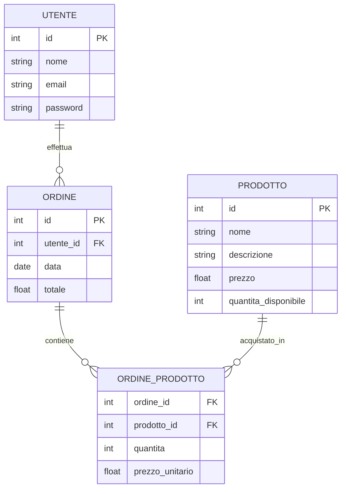

---

#### API REST: Endpoints principali

| Metodo | Endpoint                 | Descrizione                   |
| ------ | ------------------------ | ----------------------------- |
| POST   | /utenti/registrazione    | Registrazione nuovo utente    |
| POST   | /utenti/login            | Autenticazione utente         |
| GET    | /prodotti                | Elenco prodotti disponibili   |
| GET    | /prodotti/{id}           | Dettaglio prodotto            |
| POST   | /ordini                  | Creazione nuovo ordine        |
| GET    | /ordini/{id}             | Dettaglio ordine              |
| GET    | /utenti/{id}/ordini      | Storico ordini utente         |
| PUT    | /prodotti/{id}/magazzino | Aggiornamento scorte prodotto |

---

#### UML

##### Diagramma delle classi (Business Logic Layer)

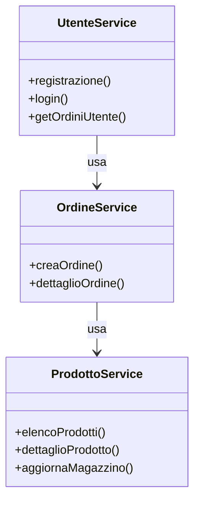

---

#### Flusso di acquisto (Tree-Tier)

1. **Utente** si registra/accede tramite Presentation Layer.
2. Naviga il catalogo prodotti, aggiunge articoli al carrello.
3. Effettua l’ordine: il Presentation Layer invia la richiesta all’Application Layer.
4. L’Application Layer verifica disponibilità, aggiorna magazzino, crea ordine.
5. Il Data Layer gestisce la persistenza di utenti, prodotti, ordini e scorte.

---

##### Diagramma di sequenza: Creazione Ordine

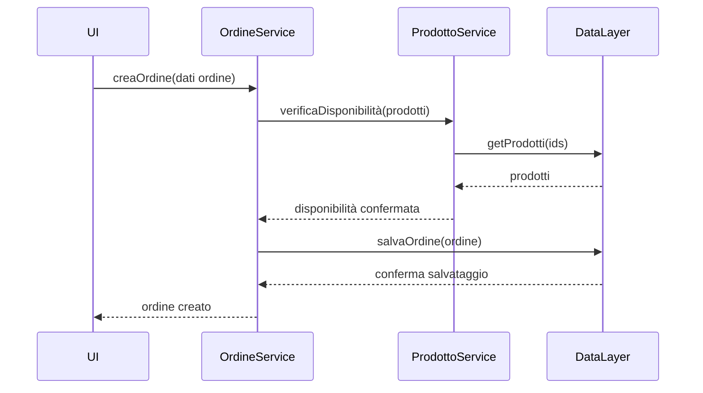

---

#### Mockup: Interfaccia Utente

```
+-----------------------------------------------------+
| Marketplace - Catalogo Prodotti                     |
+-----------------------------------------------------+
| [Login] [Registrati] [Carrello (2)]                 |
+-----------------------------------------------------+
| Nome Prodotto | Prezzo | Disponibilità | [Acquista] |
|-------------- |--------|---------------|------------|
| Smartphone X  | €399   | 12            | [Aggiungi] |
| Laptop Y      | €899   | 5             | [Aggiungi] |
+-----------------------------------------------------+
| [Dettaglio prodotto]                                |
+-----------------------------------------------------+
```

---

**Nota:**  
Questa architettura consente di scalare facilmente ogni layer, aggiungere funzionalità (es. recensioni, pagamenti, gestione spedizioni) e mantenere separazione delle responsabilità tra UI, logica di business e dati.

---

<!-- slide: UML-intro -->

### UML e Architettura Multi-Tier

- UML (Unified Modeling Language) è lo standard per modellare sistemi software complessi.
- Permette di rappresentare visivamente componenti, flussi e interazioni tra i layer di un’architettura multi-tier.

---

#### Tipi di diagrammi UML utili

- Diagramma dei casi d’uso
- Diagramma delle classi
- Diagramma dei componenti
- Diagramma di sequenza
- Diagramma delle attività
- Diagramma di stato
- Diagramma di deployment
- Diagramma dei pacchetti

---

<!-- slide: use-case -->

### Diagramma dei Casi d'Uso

- Rappresenta le funzionalità principali dal punto di vista dell’utente.
- Utile per identificare i requisiti funzionali.
- Ogni caso d’uso può coinvolgere più layer dell’architettura.
- Ad esempio, un caso d’uso "Effettuare Ordine" coinvolge la UI (Presentation), la logica di business (Application) e la gestione dei dati (Data).

<p align="center">
  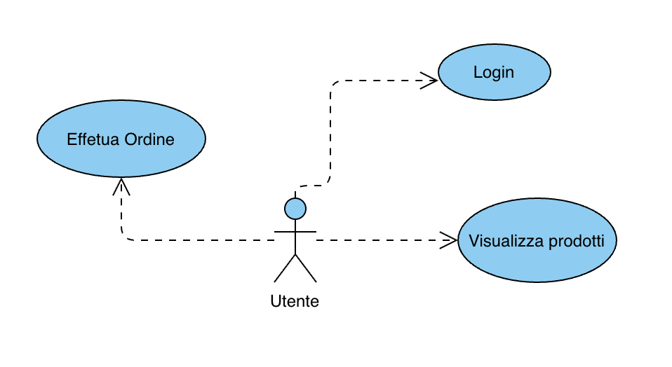
</p>

---

<!-- Diagramma Use Case: Utente -->

- Utente può:
  - Login
  - Visualizzare Prodotti
  - Aggiungere al Carrello
  - Effettuare Ordine
  - Visualizzare Ordini

---

<!-- slide: use-case-layer -->

#### Casi d'Uso

I casi d’uso sono fondamentali perché rappresentano le interazioni reali tra utenti e sistema, aiutando a chiarire i requisiti funzionali e a guidare la progettazione dell’architettura. Ogni caso d’uso permette di identificare quali layer sono coinvolti, quali dati vengono scambiati e quali processi vengono attivati. Questo facilita la comunicazione tra stakeholder, sviluppatori e designer, garantendo che l’applicazione risponda alle esigenze degli utenti e sia strutturata in modo efficace. Una buona definizione dei casi d’uso è la base per una progettazione solida, testabile e scalabile.

---

<!-- slide: class-overview -->

### Diagramma delle Classi (Overview)

- Mostra le principali classi e le loro relazioni.
- Fondamentale per il design dell’Application Layer.
- Esempio: classi per gestire utenti, prodotti, ordini e magazzino.

> **Nota:**  
> Un buon diagramma delle classi è fondamentale perché rappresenta la struttura statica di un sistema software, mostrando le classi, i loro attributi, metodi e le relazioni tra di esse. Questo tipo di diagramma aiuta a comprendere l'organizzazione del codice, facilita la comunicazione tra i membri del team, supporta la progettazione e la manutenzione del software, e permette di individuare potenziali problemi di architettura prima della fase di implementazione. Inoltre, un diagramma delle classi ben fatto rende più semplice l'estensione e la modifica del sistema nel tempo.

---

<p align="center">
  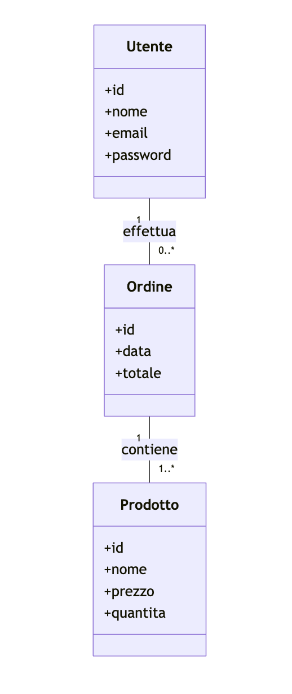
</p>

---

<!-- slide: class-layer -->

#### Classi per Layer

- Presentation: ViewModel, DTO
- Application: Service, Controller
- Data: Entity, Repository

---

- **Presentation Layer**  
  _Nota:_ Si occupa della visualizzazione e dell’interazione con l’utente.  
  _Esempio di classe:_
  ```csharp
  class ContactViewModel {
    string Nome;
    string Telefono;
    string Email;
  }
  ```

---

- **Application Layer**  
  _Nota:_ Gestisce la logica di business e il coordinamento tra i layer.  
  _Esempio di classe:_
  ```java
  public class ContactService {
    public void aggiungiContatto(ContactDTO contatto) { ... }
    public List<ContactDTO> listaContatti() { ... }
  }
  ```

---

- **Data Layer**  
  _Nota:_ Responsabile della persistenza e gestione dei dati.  
  _Esempio di classe:_
  ```python
  class ContactEntity:
      def __init__(self, id, nome, telefono, email):
          self.id = id
          self.nome = nome
          self.telefono = telefono
          self.email = email
  ```

---

<!-- slide: component-diagram -->

### Diagramma dei Componenti

- Rappresenta i moduli software e le loro dipendenze.
- Utile per visualizzare la suddivisione in Presentation, Application e Data Layer.

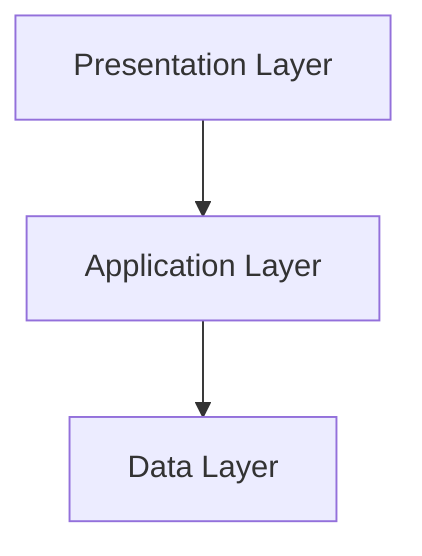

> **Nota:**  
> In un'architettura n-tier, questo diagramma è fondamentale perché permette di comprendere come i diversi tier interagiscono tra loro, evidenziando le interfacce e i confini tra i moduli. Aiuta a progettare soluzioni scalabili, modulari e facilmente distribuibili, riducendo il rischio di accoppiamento e semplificando l'evoluzione dell'applicazione.

---

<p align="center">
  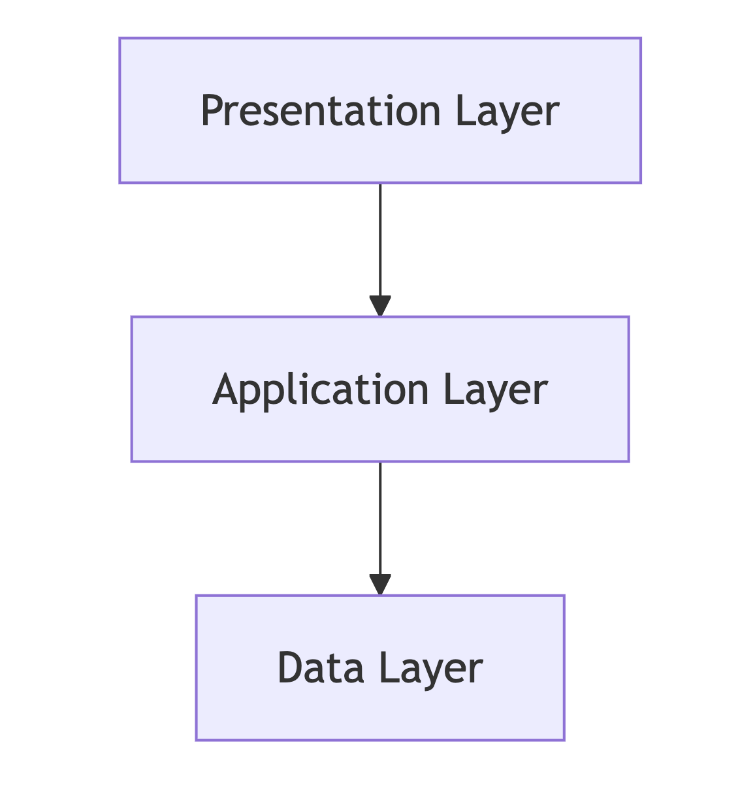
</p>

---

<!-- slide: package-diagram -->

### Diagramma dei Package

- Organizza le classi in gruppi logici (package) per layer.

```mermaid
classDiagram
  package Presentation {
    class LoginView
    class CatalogView
  }
  package Application {
    class AuthService
    class ProductService
  }
  package Data {
    class UserRepository
    class ProductRepository
  }
  LoginView --> AuthService
  CatalogView --> ProductService
  AuthService --> UserRepository
  ProductService --> ProductRepository
```

---

<!-- slide: sequence-login -->

### Diagramma di Sequenza: Login

- Mostra l’interazione tra UI, controller e repository durante il processo di login.

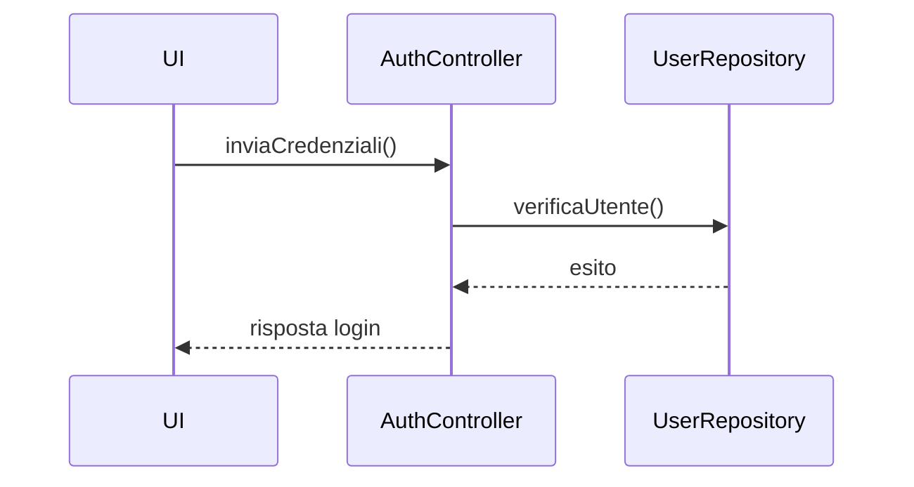

> **Nota:**  
> I diagrammi di sequenza sono strumenti essenziali per comprendere a fondo i requisiti funzionali e i casi d’uso. Visualizzano le interazioni tra componenti e attori del sistema nel tempo, chiarendo il flusso di messaggi e azioni.  
> Questo aiuta gli stakeholder a individuare ambiguità, validare scenari e assicurarsi che tutti i passaggi e le dipendenze siano correttamente rappresentati nella progettazione del sistema.

---

<p align="center">
  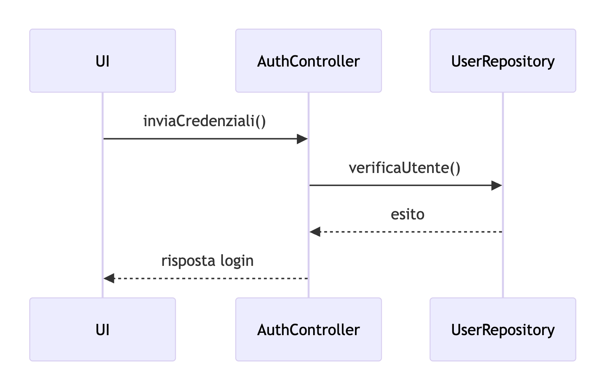
</p>

---

<!-- slide: sequence-order -->

### Diagramma di Sequenza: Creazione Ordine

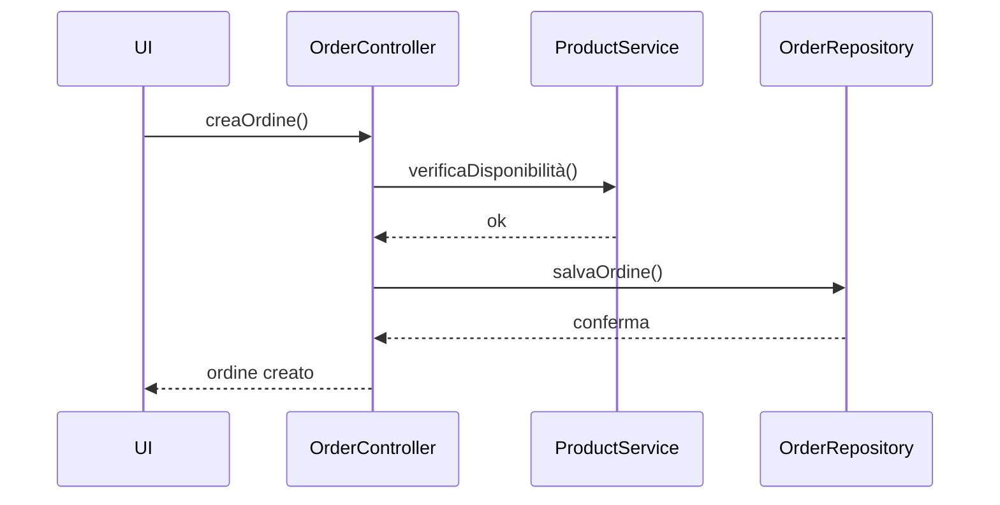

---

<p align="center">
  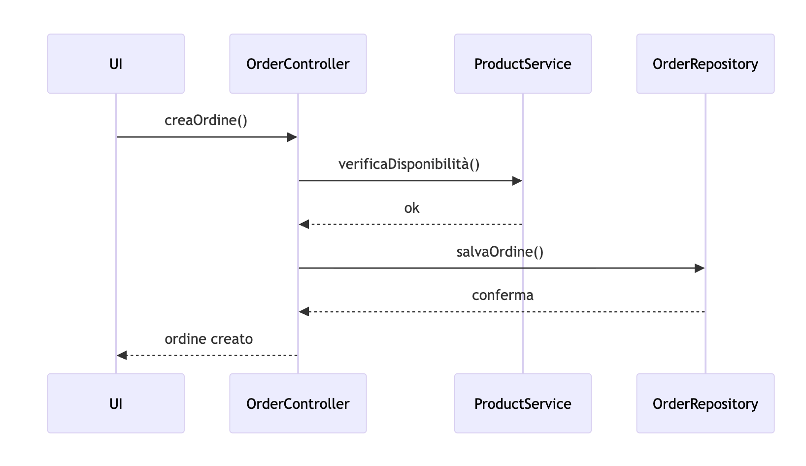
</p>

---

<!-- slide: activity-login -->

### Diagramma delle Attività: Login

- Rappresenta il flusso di attività durante il processo di login, evidenziando i passaggi decisionali (es. credenziali corrette o errate).

#### Perché il diagramma delle attività è diverso dal diagramma di sequenza

Il **diagramma delle attività** rappresenta il flusso delle operazioni e delle decisioni, mostrando come si passa da un'attività all'altra in base a condizioni o eventi. È utile per visualizzare processi, percorsi alternativi e logica di controllo.

Il **diagramma di sequenza**, invece, mostra l'interazione tra oggetti o componenti nel tempo, evidenziando lo scambio di messaggi e la sequenza delle chiamate tra i vari attori del sistema.

> **Sintesi:**  
> Il diagramma delle attività si concentra sul flusso logico e sulle decisioni, mentre il diagramma di sequenza si focalizza sulle interazioni temporali tra componenti.

---

<p align="center">
  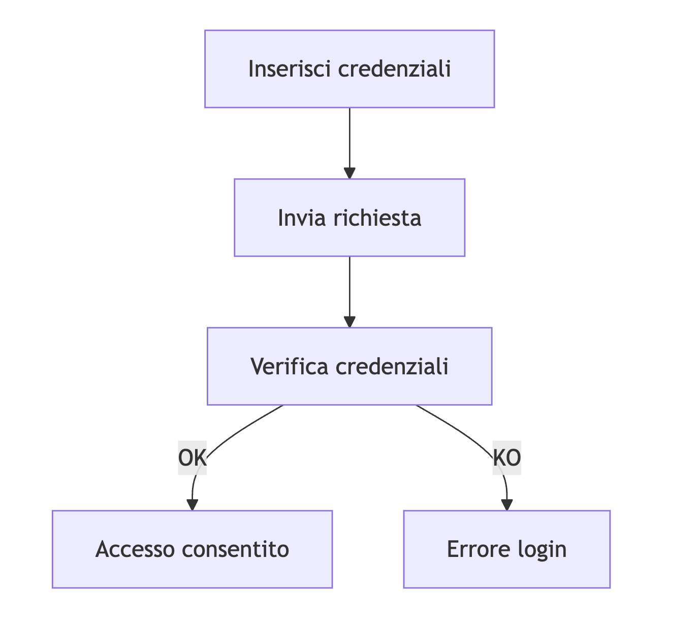
</p>

---

<!-- slide: activity-order -->

### Diagramma delle Attività: Acquisto Prodotto

<p align="center">
  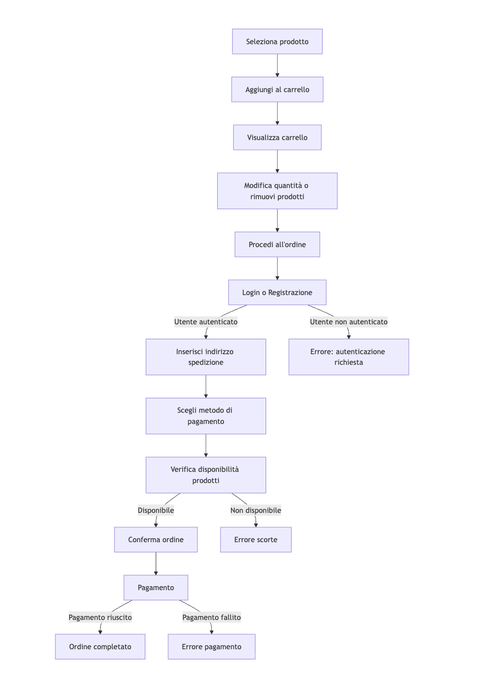
</p>

---

<!-- slide: state-order -->

### Diagramma di Stato: Ordine

<p align="center">
  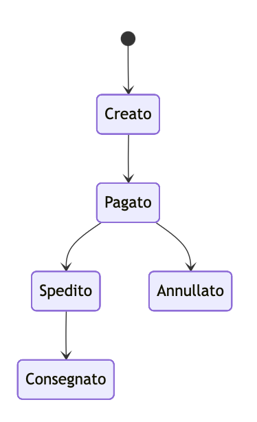
</p>

---

<!-- slide: deployment-diagram -->

### Diagramma di Deployment

- Mostra la distribuzione fisica dei layer su server e dispositivi.

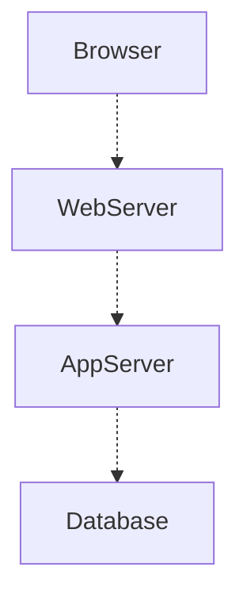

---

<!-- slide: component-detail -->

### Dettaglio Componenti Application Layer

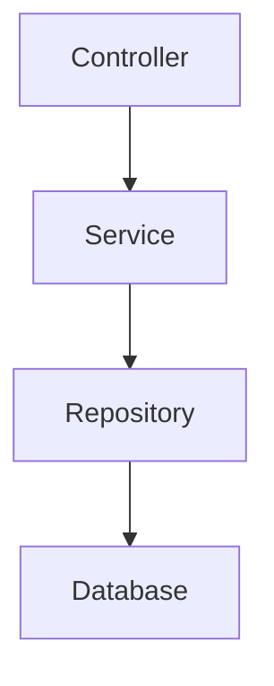

---

<!-- slide: entity-relationship -->

### Diagramma ER (Entity-Relationship)

- Utile per progettare il Data Layer.

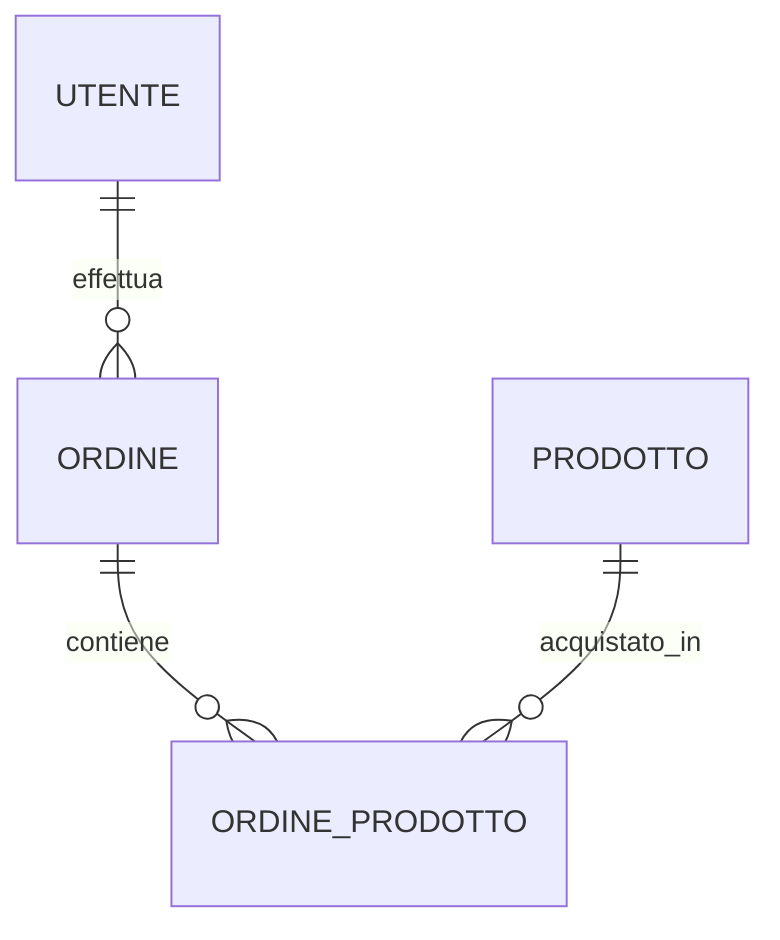

---

<!-- slide: boundary-control-entity -->

### Pattern Boundary-Control-Entity

- Boundary: interfaccia utente o API
- Control: logica di business
- Entity: dati persistenti

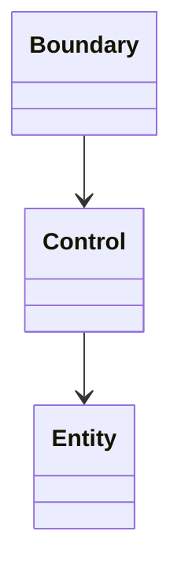

---

<!-- slide: collaboration-diagram -->

### Diagramma di Collaborazione

- Mostra le interazioni tra oggetti per realizzare un caso d’uso.

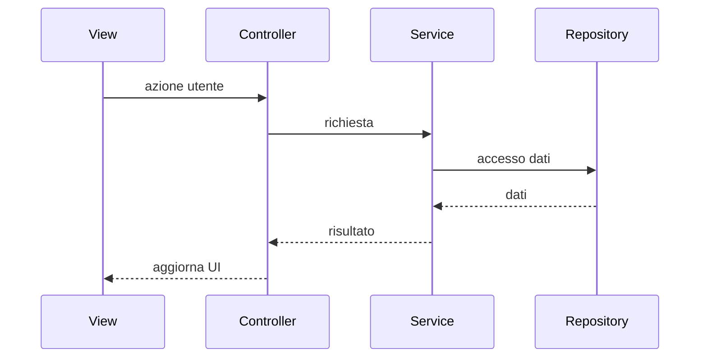

---

<!-- slide: summary -->

### Sommario: UML per Multi-Tier

- Usa i diagrammi UML per:
  - Analizzare i requisiti (casi d’uso)
  - Progettare la struttura (classi, componenti, pacchetti)
  - Modellare i flussi (sequenza, attività, stato)
  - Definire la distribuzione (deployment)
- La combinazione di questi diagrammi facilita la progettazione, la comunicazione e la documentazione di architetture multi-tier.

---

### Lezione 2: Laboratorio di Progettazione Tree-Tier

---

#### Obiettivo del Laboratorio

- Progettare una semplice applicazione Tree-Tier:
- Gestione di una rubrica contatti

---

#### Fasi del Laboratorio

1. **Definizione dei requisiti**
2. **Progettazione dei layer**
3. **Implementazione di base**
4. **Test e verifica**

---

#### Step 1: Presentation Layer

- Creare mockup dell'interfaccia utente
- Definire le funzionalità: aggiungi, modifica, elimina contatti

---

#### Step 2: Application Layer

- Progettare API per la gestione dei contatti
- Definire endpoints: GET, POST, PUT, DELETE

---

#### Step 3: Data Layer

- Progettare schema database per i contatti
- Esempio tabella: `Contatti (id, nome, telefono, email)`

---

#### Step 4: Integrazione e Test

- Collegare i layer
- Testare il flusso completo: inserimento, modifica, eliminazione

---

#### Discussione Finale

- Analisi dei vantaggi riscontrati
- Possibili miglioramenti e estensioni future
