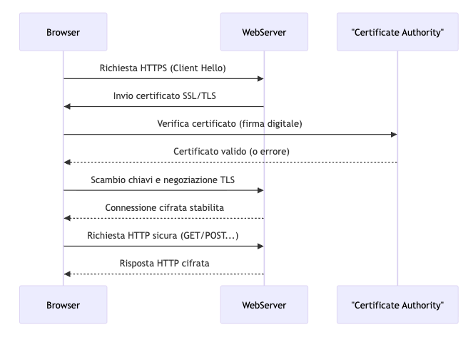

# Tecnologie web per Data Analyst

## Introduzione al corso, architettura client-server

```js
/**
 * @author Rocco Mazzeo
 * @email rocco.mazzeo@gmail.com
 * @linkedin https://www.linkedin.com/in/roccomazzeo
 */
```

---

## Obiettivi della lezione

- Presentare il corso e i suoi obiettivi
- Comprendere il ruolo delle tecnologie web per il Data Analyst
- Introdurre l’architettura client-server
- Discutere casi d’uso e scenari reali

---

## Struttura del corso

- **Durata:** 2 ore
- **Argomenti principali:**
  - Introduzione alle tecnologie web
  - Architettura client-server
  - Esempi pratici e casi d’uso
- **Modalità:** Lezione frontale + domande

---

## Cos’è il web?

- Insieme di tecnologie che permettono la condivisione di informazioni su Internet
- Basato su protocolli standard (HTTP, HTTPS)
- Accessibile tramite browser web

---

## Componenti fondamentali del web

- **URL (Uniform Resource Locator):** indirizzo univoco per identificare risorse sul web
- **Browser:** software che interpreta HTML, CSS, JS e visualizza le pagine web
- **Server web:** programma che riceve richieste e invia risposte (es. Apache, Nginx)
- **Protocolli:** regole di comunicazione (HTTP, HTTPS, WebSocket)
- **DNS (Domain Name System):** traduce nomi di dominio in indirizzi IP

---

## Come funziona una pagina web

1. L’utente inserisce un URL nel browser
2. Il browser effettua una richiesta DNS per ottenere l’indirizzo IP del server
3. Il browser invia una richiesta HTTP/HTTPS al server
4. Il server risponde con il codice HTML della pagina
5. Il browser scarica risorse aggiuntive (CSS, JS, immagini)
6. La pagina viene renderizzata e visualizzata all’utente

---

## Differenza tra Internet e Web

- **Internet:** infrastruttura globale di reti interconnesse
- **Web:** servizio che utilizza Internet per condividere informazioni tramite pagine collegate (hyperlink)

---

## Standard e organizzazioni del web

- **W3C:** definisce gli standard per HTML, CSS, XML, ecc.
- **WHATWG:** gruppo di lavoro per l’evoluzione di HTML e DOM
- **IETF:** definisce protocolli come HTTP, TCP/IP

---

## Breve storia del web

- **1989:** Tim Berners-Lee propone il World Wide Web al CERN
- **1991:** Primo sito web pubblicato
- **1993:** Nasce Mosaic, il primo browser grafico
- **1994:** Fondazione del W3C (World Wide Web Consortium)
- **Anni 2000:** Diffusione di AJAX, social network e web dinamico
- **Oggi:** Web mobile, cloud, intelligenza artificiale e decentralizzazione

---

## Curiosità sul web

- Il primo sito web è ancora online: [info.cern.ch](http://info.cern.ch)
- Il simbolo “www” non è obbligatorio nei nomi di dominio
- Il browser Mosaic, antesignano di Netscape, fu fondamentale per la diffusione del web
- Google indicizza oltre 100 miliardi di pagine web
- Il termine “surfing the web” fu coniato da Jean Armour Polly nel 1992
- Il web “profondo” (deep web) contiene molti più dati rispetto al web accessibile dai motori di ricerca
- Il dark web è una piccola parte del deep web, accessibile solo tramite software speciali (es. Tor browser)
- Il linguaggio HTML è stato creato nel 1991 e continua ad evolversi ancora oggi

---

## Perché il web è importante per i Data Analyst?

- **Accesso a grandi quantità di dati:** Il web offre strumenti e piattaforme per raccogliere, aggregare e consultare dataset provenienti da fonti diverse (open data, API pubbliche, database online), facilitando l’analisi su larga scala.
- **Visualizzazione e condivisione dei risultati:** Le tecnologie web permettono di creare dashboard interattive, report dinamici e visualizzazioni grafiche facilmente accessibili e condivisibili tramite browser, favorendo la collaborazione tra team e stakeholder.
- **Automazione di processi tramite API:** Attraverso le API web, è possibile automatizzare il recupero, l’aggiornamento e l’integrazione dei dati nei flussi di lavoro, riducendo errori manuali e aumentando l’efficienza delle analisi.

---

## Architetture Client-Server nel web

L’architettura client-server è il modello fondamentale su cui si basa il funzionamento del web moderno. In questo modello, il **client** (tipicamente un browser) invia richieste a un **server** (web server), che elabora le richieste e restituisce le risposte, spesso attingendo a un **database** per recuperare o memorizzare dati.

---

## Storia e diffusione

- **Anni ‘90:** Con la nascita del World Wide Web, il modello client-server si afferma come standard per la distribuzione di contenuti e servizi su Internet.
- **Evoluzione:** Dalle prime applicazioni statiche si è passati a sistemi dinamici, multi-tier e, più recentemente, a microservizi e architetture serverless.
- **Oggi:** Quasi tutte le applicazioni web, dai siti informativi alle piattaforme cloud, si basano su varianti di questo modello.

---

## Utilizzo pratico

- **Navigazione web:** Ogni volta che un utente visita un sito, il browser (client) invia richieste HTTP al server, che risponde con pagine HTML, dati JSON, immagini, ecc.
- **Applicazioni moderne:** Le Single Page Application (SPA) e le Progressive Web App (PWA) sfruttano il modello client-server per aggiornare dinamicamente i dati senza ricaricare l’intera pagina.
- **API:** I client possono essere anche applicazioni mobili o altri servizi che comunicano con server tramite API REST o WebSocket.

---

## Vantaggi delle architetture client-server

- **Scalabilità:** Possibilità di gestire molti client contemporaneamente, distribuendo il carico su più server.
- **Manutenibilità:** Separazione tra interfaccia utente (frontend) e logica di business (backend), facilitando aggiornamenti e sviluppo parallelo.
- **Sicurezza:** I dati sensibili possono essere protetti lato server, limitando l’accesso diretto da parte dei client.

---

## Svantaggi principali

- **Dipendenza dalla rete:** Il funzionamento dipende dalla connessione tra client e server; eventuali interruzioni possono bloccare il servizio.
- **Complessità:** Gestire autenticazione, autorizzazione, scalabilità e sicurezza può richiedere infrastrutture e competenze avanzate.
- **Costi:** L’infrastruttura server-side può comportare costi di gestione e manutenzione, soprattutto per applicazioni ad alta disponibilità.

---

## Evoluzione delle applicazioni web: dal server al browser

In passato, la maggior parte della logica applicativa risiedeva interamente sul server: il browser si limitava a visualizzare pagine HTML generate dinamicamente dal backend (es. PHP, ASP.NET). Ogni interazione dell’utente comportava una nuova richiesta al server e il ricaricamento della pagina.

Con l’avvento delle **Single Page Application (SPA)**, gran parte della logica si è spostata sul browser. Le SPA caricano una singola pagina HTML e utilizzano JavaScript per gestire la navigazione, aggiornare dinamicamente i contenuti e comunicare con il server tramite API (tipicamente REST o GraphQL). Questo approccio offre:

- Esperienza utente più fluida e reattiva
- Riduzione dei caricamenti completi di pagina
- Maggiore interattività e possibilità di creare applicazioni web complesse (es. dashboard, editor, gestionali)

---

**Esempi di SPA:** Gmail, Google Maps, Trello, Facebook.

**Tecnologie principali:** React, Angular, Vue.js.

---

## HTTP: il protocollo del web

HTTP è il protocollo fondamentale che permette la comunicazione tra client e server sul web. È stato progettato per essere semplice, estendibile e indipendente dalla piattaforma, il che ha favorito la sua rapida adozione e diffusione.

### Perché HTTP è così noto?

- **Standard universale:** HTTP è adottato da tutti i browser e server web, diventando lo standard di fatto per la trasmissione di dati su Internet.
- **Semplicità:** La struttura delle richieste e delle risposte è facilmente comprensibile e leggibile anche da esseri umani.
- **Estendibilità:** HTTP supporta l’aggiunta di nuove funzionalità tramite header e metodi personalizzati.
- **Interoperabilità:** Permette a sistemi diversi di comunicare tra loro senza dipendenze specifiche.

### Evoluzione di HTTP

- **HTTP/0.9 (1991):** Prima versione, supportava solo richieste GET e risposte di testo.
- **HTTP/1.0 (1996):** Introdotti header, codici di stato e supporto per diversi tipi di contenuto.
- **HTTP/1.1 (1997):** Connessioni persistenti, chunked transfer encoding, caching avanzato.
- **HTTP/2 (2015):** Multiplexing delle richieste, compressione degli header, maggiore efficienza e velocità.
- **HTTP/3 (in sviluppo):** Basato su QUIC (UDP), riduce la latenza e migliora la sicurezza.

L’evoluzione di HTTP ha permesso al web di adattarsi a nuove esigenze, migliorando prestazioni, sicurezza e scalabilità delle applicazioni moderne.

---

## Struttura del protocollo HTTP

HTTP (HyperText Transfer Protocol) è un protocollo di livello applicativo basato su un modello richiesta/risposta tra client e server. Ogni comunicazione HTTP segue una struttura ben definita:

### 1. Richiesta HTTP

Una richiesta HTTP è composta da:

- **Linea di richiesta:** specifica il metodo (GET, POST, PUT, DELETE, ecc.), il percorso della risorsa e la versione del protocollo.
- **Header:** coppie chiave/valore che forniscono informazioni aggiuntive (es. `Host`, `User-Agent`, `Accept`, `Authorization`).
- **Corpo (opzionale):** presente solo in alcuni metodi (es. POST, PUT) e contiene i dati inviati al server.

---

**Esempio:**

```
GET /pagina.html HTTP/1.1
Host: www.example.com
User-Agent: Mozilla/5.0
Accept: text/html
```

---

### 2. Risposta HTTP

Una risposta HTTP è composta da:

- **Linea di stato:** indica la versione del protocollo, il codice di stato (es. 200, 404, 500) e il messaggio associato.
- **Header:** informazioni aggiuntive sulla risposta (es. `Content-Type`, `Content-Length`, `Set-Cookie`).
- **Corpo:** contiene i dati richiesti (HTML, JSON, immagini, ecc.).

---

**Esempio:**

```
HTTP/1.1 200 OK
Content-Type: text/html
Content-Length: 1234

<html>...</html>
```

---

### 3. Metodi principali (HTTP verbs)

- **GET:** recupera una risorsa
- **POST:** invia dati al server
- **PUT:** aggiorna una risorsa
- **DELETE:** elimina una risorsa
- **HEAD:** come GET ma senza corpo della risposta
- **OPTIONS:** restituisce i metodi supportati dal server
- **PATCH:** applica modifiche parziali a una risorsa

---

### 4. Codici di stato (HTTP Status Codes)

- **2xx:** successo (es. 200 OK)
- **3xx:** redirezione (es. 301 Moved Permanently)
- **4xx:** errore client (es. 404 Not Found)
- **5xx:** errore server (es. 500 Internal Server Error)

HTTP è un protocollo senza stato (stateless): ogni richiesta è indipendente dalle altre. Per mantenere informazioni tra richieste si usano cookie, sessioni o token.

---

### Posizionamento di HTTP nella pila dei protocolli

**HTTP** opera al **livello 7 (Applicazione)** del modello OSI. Si appoggia tipicamente su TCP (livello 4) e IP (livello 3). La pila reale di protocolli per una richiesta HTTP è quindi:

- Applicazione: **HTTP**
- Trasporto: **TCP**
- Rete: **IP**
- Collegamento dati: Ethernet/Wi-Fi, ecc.
- Fisico: cavo, fibra, onde radio, ecc.

Questo posizionamento permette a HTTP di concentrarsi sulla comunicazione tra applicazioni, delegando la trasmissione dei dati ai livelli inferiori.

---

# Struttura di una richiesta HTTP

- Una richiesta HTTP è composta da:
  - **Metodo**: indica l’azione (GET, POST, PUT, DELETE, ecc.)
  - **URL**: risorsa richiesta
  - **Header**: informazioni aggiuntive (User-Agent, Accept, ecc.)
  - **Body**: dati inviati (solo in alcuni metodi, es. POST)

---

**Esempio di interazione client-server:**

```
Browser (Client)          Web Server
  |                       |
  |  Richiesta HTTP       |
  |---------------------> |
  |   (GET /index.html)   |
  |                       |
  |  Risposta HTTP        |
  | <-------------------- |
  | (200 OK + index.html) |
  |                       |
```

Questo schema mostra come il browser invia una richiesta HTTP al server e riceve una risposta con la risorsa richiesta.

---

# Strumenti per testare le API: Postman

- **Postman** è uno strumento grafico molto usato per testare e sviluppare API web.
- Permette di inviare richieste HTTP (GET, POST, ecc.), vedere le risposte, analizzare header e body, e automatizzare test.
- Utile sia per sviluppatori backend che frontend.
- [Scarica Postman](https://www.postman.com/downloads/) per Windows, macOS o Linux dal sito ufficiale.

---

## Esempio: richiesta GET a una pagina pubblica con Postman

1. Apri Postman e crea una nuova richiesta.
2. Seleziona il metodo **GET**.
3. Inserisci l’URL della risorsa, ad esempio:  
   `https://www.google.com`
4. Premi **Send**.

---

**Risultato atteso:**  
Riceverai una risposta HTTP con status code `200 OK` e il body con il codice HTML della homepage di Google.

```
GET / HTTP/1.1
Host: www.google.com
User-Agent: PostmanRuntime/7.32.2
Accept: */*
...

HTTP/1.1 200 OK
Content-Type: text/html; charset=ISO-8859-1
...
<html>...</html>
```

- Puoi visualizzare header, status code e contenuto della risposta direttamente nell’interfaccia di Postman.
- Postman permette anche di salvare richieste e creare collezioni di test.

---

## Esercizio: Visualizzare richiesta e risposta HTTP con Postman

1. Apri Postman e crea una nuova richiesta.
2. Seleziona il metodo **GET**.
3. Inserisci l’URL:  
   `https://jsonplaceholder.typicode.com/posts/1`
4. Premi **Send**.

**Osserva:**

- Nella scheda **Request** puoi vedere i dettagli della richiesta inviata (metodo, URL, header).
- Nella scheda **Response** puoi vedere lo status code, gli header e il body della risposta.

---

**Esempio di risposta:**

```
GET /posts/1 HTTP/1.1
Host: jsonplaceholder.typicode.com

HTTP/1.1 200 OK
Content-Type: application/json; charset=utf-8
...

{
  "userId": 1,
  "id": 1,
  "title": "sunt aut facere repellat provident occaecati excepturi optio reprehenderit",
  "body": "quia et suscipit..."
}
```

---

# Struttura di una risposta HTTP

- Una risposta HTTP contiene:
  - **Status code**: codice di stato (200 OK, 404 Not Found, 500 Internal Server Error, ecc.)
  - **Header**: informazioni sulla risposta (Content-Type, Set-Cookie, ecc.)
  - **Body**: contenuto della risposta (pagina HTML, JSON, file, ecc.)

---

### Status Code

| Status Code | Significato           | Descrizione breve                   |
| ----------- | --------------------- | ----------------------------------- |
| 200         | OK                    | Richiesta eseguita con successo     |
| 301         | Moved Permanently     | Risorsa spostata in modo permanente |
| 404         | Not Found             | Risorsa non trovata                 |
| 500         | Internal Server Error | Errore interno del server           |

---

### Header

| Header         | Descrizione                             | Esempio                     |
| -------------- | --------------------------------------- | --------------------------- |
| Content-Type   | Tipo di contenuto restituito            | text/html, application/json |
| Set-Cookie     | Imposta cookie nel browser              | sessionid=abc123; Path=/    |
| Content-Length | Dimensione del body in byte             | 348                         |
| Location       | URL di reindirizzamento (usato con 3xx) | https://esempio.com/nuovo   |

---

### Body

| Body | Descrizione                                  | Esempio               |
| ---- | -------------------------------------------- | --------------------- |
| HTML | Pagina web visualizzabile dal browser        | `<html>...</html>`    |
| JSON | Dati strutturati per applicazioni web        | `{ "nome": "Mario" }` |
| File | Qualsiasi tipo di file (immagine, PDF, ecc.) | (binario o base64)    |

---

### Elenco completo degli HTTP Status Code

Gli status code HTTP sono suddivisi in 5 classi principali:

#### 1xx — Informational

| Codice | Significato         | Descrizione breve              |
| ------ | ------------------- | ------------------------------ |
| 100    | Continue            | Richiesta ricevuta, continuare |
| 101    | Switching Protocols | Cambio di protocollo richiesto |
| 102    | Processing          | Elaborazione in corso (WebDAV) |
| 103    | Early Hints         | Informazioni preliminari       |

---

#### 2xx — Success

| Codice | Significato | Descrizione breve                    |
| ------ | ----------- | ------------------------------------ |
| 200    | OK          | Richiesta eseguita con successo      |
| 201    | Created     | Risorsa creata                       |
| 202    | Accepted    | Richiesta accettata, in elaborazione |
| 204    | No Content  | Nessun contenuto da restituire       |

---

#### 3xx — Redirection (parte 1)

| Codice | Significato       | Descrizione breve                        |
| ------ | ----------------- | ---------------------------------------- |
| 301    | Moved Permanently | Risorsa spostata in modo permanente      |
| 302    | Found             | Risorsa trovata (redirezione temporanea) |
| 304    | Not Modified      | Risorsa non modificata                   |

---

#### 3xx — Redirection (parte 2)

| Codice | Significato        | Descrizione breve      |
| ------ | ------------------ | ---------------------- |
| 305    | Use Proxy          | Usare un proxy         |
| 306    | (Unused)           | Codice non utilizzato  |
| 307    | Temporary Redirect | Redirezione temporanea |
| 308    | Permanent Redirect | Redirezione permanente |

---

#### 4xx — Client Error (parte 1)

| Codice | Significato            | Descrizione breve            |
| ------ | ---------------------- | ---------------------------- |
| 400    | Bad Request            | Richiesta non valida         |
| 401    | Unauthorized           | Non autorizzato              |
| 403    | Forbidden              | Accesso negato               |
| 404    | Not Found              | Risorsa non trovata          |
| 405    | Method Not Allowed     | Metodo non consentito        |
| 415    | Unsupported Media Type | Tipo di media non supportato |

---

#### 4xx — Client Error (parte 4)

| Codice | Significato       | Descrizione breve           |
| ------ | ----------------- | --------------------------- |
| 418    | I'm a teapot      | Sono una teiera (scherzoso) |
| 429    | Too Many Requests | Troppe richieste            |

---

#### 5xx — Server Error

| Codice | Significato                | Descrizione breve             |
| ------ | -------------------------- | ----------------------------- |
| 500    | Internal Server Error      | Errore interno del server     |
| 501    | Not Implemented            | Funzionalità non implementata |
| 502    | Bad Gateway                | Gateway non valido            |
| 503    | Service Unavailable        | Servizio non disponibile      |
| 504    | Gateway Timeout            | Timeout del gateway           |
| 505    | HTTP Version Not Supported | Versione HTTP non supportata  |

---

## Esercizio: Ottenere risposte 404 e 500 con Postman

### 1. Ottenere una risposta **404 Not Found**

- Apri Postman e crea una nuova richiesta **GET**.
- Inserisci un URL che non esiste, ad esempio:  
  `https://jsonplaceholder.typicode.com/nonexistent`
- Premi **Send**.

---

**Esempio di risposta:**

```
GET /nonexistent HTTP/1.1
Host: jsonplaceholder.typicode.com

HTTP/1.1 404 Not Found
Content-Type: application/json; charset=utf-8
...

{
  "error": "Not Found"
}
```

---

### 2. Ottenere una risposta **500 Internal Server Error**

- Per simulare un errore 500, puoi usare servizi di test come [https://mock.httpstatus.io/](https://mock.httpstatus.io/).
- Crea una richiesta **GET** su:  
  `https://mock.httpstatus.io/500`
- Premi **Send**.

**Esempio di risposta:**

```
GET /500 HTTP/1.1
Host: httpstat.us

HTTP/1.1 500 Internal Server Error
Content-Type: text/html; charset=utf-8
...

500 Internal Server Error
```

---

**Nota:**  
Le risposte 404 e 500 sono utili per testare la gestione degli errori nelle applicazioni web.

---

# HTTP vs HTTPS

- **HTTP**: dati trasmessi in chiaro, non sicuro
- **HTTPS**: HTTP su TLS/SSL, dati cifrati e autenticati

##### HTTPS è lo standard attuale per la sicurezza delle comunicazioni web

---

# Approfondimento: HTTPS e SSL/TLS

- **HTTPS** (HyperText Transfer Protocol Secure) è la versione sicura di HTTP.
- Utilizza **SSL/TLS** (Secure Sockets Layer / Transport Layer Security) per cifrare i dati trasmessi tra client e server.
- La cifratura protegge da intercettazioni e manomissioni dei dati (es. password, dati personali).

---

# Approfondimento: HTTPS e SSL/TLS (2)

- HTTPS garantisce:
  - **Confidenzialità**: i dati non possono essere letti da terzi.
  - **Integrità**: i dati non possono essere modificati durante il transito.
  - **Autenticità**: il client può verificare l’identità del server tramite certificati digitali.
- I certificati SSL/TLS sono rilasciati da **Certificate Authority** (CA) affidabili.
- Oggi HTTPS è fondamentale per la sicurezza di qualsiasi sito web.

---

# Schema: Certificato HTTPS e Certificate Authority (CA)

<div align="center">



</div>

---

# Deep Focus: HTTPS e Certificati TLS

## Cos’è un certificato digitale?

Un **certificato digitale** è un file elettronico che attesta l’identità di un sito web (o di un’entità) e consente la creazione di una connessione sicura tramite HTTPS. I certificati sono rilasciati da una **Certificate Authority (CA)** affidabile.

---

### Struttura di un certificato TLS

Un certificato TLS (solitamente in formato X.509) contiene:

- **Versione**: versione dello standard X.509
- **Numero di serie**: identificativo univoco del certificato
- **Algoritmo di firma**: algoritmo usato dalla CA per firmare il certificato (es. SHA256-RSA)
- **Emittente (Issuer)**: dati della CA che ha rilasciato il certificato
- **Periodo di validità**: data di inizio e fine validità
- **Soggetto (Subject)**: dati del proprietario (es. nome dominio, organizzazione)
- **Chiave pubblica**: chiave pubblica del server
- **Estensioni**: informazioni aggiuntive (es. uso della chiave, nomi alternativi)
- **Firma digitale**: generata dalla CA per garantire l’autenticità

---

### Esempio (semplificato) di certificato X.509

```
Certificate:
  Data:
    Version: 3 (0x2)
    Serial Number: 1234567890
    Signature Algorithm: sha256WithRSAEncryption
    Issuer: CN=Let's Encrypt Authority X3, O=Let's Encrypt, C=US
    Validity
      Not Before: Jun  1 00:00:00 2024 GMT
      Not After : Aug 30 23:59:59 2024 GMT
    Subject: CN=www.esempio.com
    Subject Public Key Info:
      Public Key Algorithm: rsaEncryption
        Public-Key: (2048 bit)
        Modulus: ...
        Exponent: ...
    X509v3 extensions:
      X509v3 Subject Alternative Name:
        DNS:www.esempio.com, DNS:esempio.com
  Signature Algorithm: sha256WithRSAEncryption
     Signature: ...
```

---

## Come funziona la catena di fiducia

1. Il browser riceve il certificato dal server.
2. Verifica che il certificato sia stato firmato da una CA presente tra quelle fidate.
3. Controlla che il certificato sia valido (date, dominio, firma).
4. Se tutto è corretto, viene stabilita una connessione sicura.

---

## Tipi di certificati TLS

- **DV (Domain Validation):** verifica solo il controllo sul dominio.
- **OV (Organization Validation):** verifica anche i dati dell’organizzazione.
- **EV (Extended Validation):** verifica approfondita, mostra il nome dell’azienda nella barra del browser.

---

## Certificati root, intermedi e catena di certificazione

- **Root CA:** autorità principale, preinstallata nei browser/sistemi operativi.
- **CA intermedie:** emettono certificati per i siti, firmate dalla root CA.
- **Certificato del server:** usato dal sito web, firmato da una CA intermedia.

La catena di certificazione collega il certificato del server fino alla root CA.

---

**In sintesi:**  
I certificati TLS sono fondamentali per garantire sicurezza, autenticità e integrità nelle comunicazioni HTTPS. La loro struttura e la catena di fiducia permettono ai browser di verificare che il sito visitato sia realmente quello dichiarato.

---

## Esempi pratici: Visualizzare certificati HTTPS online

### 1. Visualizzare il certificato di un sito con il browser

- **Chrome/Edge/Firefox:**
  1. Visita un sito HTTPS, ad esempio [https://www.google.com](https://www.google.com).
  2. Clicca sull’icona del lucchetto nella barra degli indirizzi.
  3. Seleziona “Il certificato è valido” o “Mostra certificato” per vedere i dettagli.

### 2. Strumenti online per analizzare certificati

- [SSL Labs - SSL Test](https://www.ssllabs.com/ssltest/analyze.html):  
  Inserisci il dominio di un sito per ottenere un report dettagliato sul certificato e la configurazione HTTPS.

- [crt.sh](https://crt.sh/):  
  Motore di ricerca per certificati pubblici. Inserisci un dominio per vedere tutti i certificati emessi.

### 3. Visualizzare la catena di certificazione

- [Certificate Chain Viewer](https://certificatechain.io/):  
  Inserisci il dominio di un sito per vedere la catena completa dei certificati (root, intermedi, server).

---

**Prova subito:**

- Vai su [https://www.google.com](https://www.google.com), clicca sul lucchetto e osserva i dettagli del certificato.
- Analizza un dominio a tua scelta su [SSL Labs](https://www.ssllabs.com/ssltest/analyze.html).

---

### Focus su DevTools del browser

- **DevTools** è uno strumento integrato nei browser moderni (Chrome, Firefox, Edge) che permette di ispezionare e debuggare le pagine web.
- Per accedere a DevTools, premi `F12` o clicca con il tasto destro su una pagina e seleziona “Ispeziona” (o “Inspect”).
- DevTools offre diverse schede utili per analizzare le richieste HTTP, i certificati TLS, le performance e molto altro.

---

### Scheda “Security” in DevTools

- La scheda “Security” (Sicurezza) in DevTools mostra informazioni sulla sicurezza della connessione, inclusi i dettagli del certificato TLS.

- Qui puoi vedere:
  - Se la connessione è sicura (HTTPS)
  - Il nome del certificato e l’emittente
  - La validità del certificato
  - Eventuali problemi di sicurezza (es. certificato scaduto, non valido, ecc.)

---

### Scheda “Network” in DevTools

- La scheda “Network” (Rete) permette di monitorare tutte le richieste HTTP/HTTPS effettuate dalla pagina.
- Puoi cliccare su ogni richiesta per vedere i dettagli, inclusi:
  - URL richiesto
  - Metodo HTTP
  - Status code della risposta
  - Header della richiesta e della risposta
  - Body della risposta (es. HTML, JSON, immagini)
- Utile per analizzare il flusso di dati tra client e server e identificare eventuali problemi di sicurezza o performance.

---

## Focus: Override in DevTools

La funzionalità **Override** di DevTools permette di modificare localmente file caricati da un sito web (come HTML, CSS o JavaScript) e vedere i cambiamenti in tempo reale, senza alterare il server.

---

### Come usare Override

1. Apri DevTools (`F12` o tasto destro → "Ispeziona").
2. Vai nella scheda **Sources**.
3. Nel pannello di sinistra, clicca su **Overrides**.
4. Scegli una cartella locale dove DevTools potrà salvare le modifiche (ti verrà chiesto di concedere l’accesso).
5. Attiva l’opzione **Enable Local Overrides**.
6. Naviga su una risorsa (es. un file CSS), modificala direttamente nell’editor.
7. Salva (`Cmd+S` o `Ctrl+S`): la modifica verrà applicata localmente e resterà attiva anche aggiornando la pagina.

**Nota:**  
Override è utile per testare modifiche rapide al frontend, debug di stili o script, e simulare cambiamenti senza toccare il codice sorgente originale.

---

## Conclusioni

- Il web è una piattaforma fondamentale per i Data Analyst, offrendo accesso a dati, strumenti di visualizzazione e API.
- L’architettura client-server è alla base del funzionamento del web moderno, con il browser che funge da client e i server che gestiscono le richieste.
- HTTP è il protocollo principale per la comunicazione web, mentre HTTPS garantisce sicurezza tramite cifratura TLS.
- Strumenti come Postman e DevTools sono essenziali per testare e analizzare le comunicazioni web, comprendere i certificati TLS e migliorare la sicurezza delle applicazioni.
